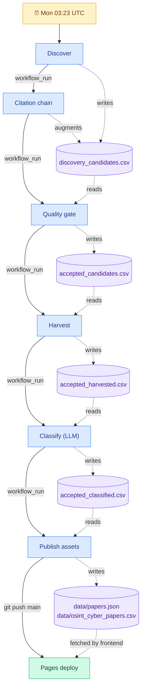

# Alex v2.1.1 Production-Ready Package

Alex is a production-oriented discovery, evaluation, enrichment, and publishing pipeline for building a **high-quality OSINT + cybersecurity research corpus**.

## What this package does

It implements a practical end-to-end system for:

1. **Discovery** across multiple source families
2. **Citation chaining** using OpenAlex and Semantic Scholar
3. **Quality scoring** before public inclusion
4. **Authoritative metadata harvesting**
5. **LLM taxonomy tagging**
6. **Governance outputs** for review and rejection
7. **Static-site publication** via GitHub Pages

## Source families checked

### Academic indexes
- OpenAlex
- Crossref
- Semantic Scholar
- CORE
- BASE (manual-assist placeholder / ingestion adapter)
- Dimensions (manual-assist placeholder)

### Research repositories
- arXiv
- Zenodo
- GitHub

### Security conferences and archives
- IEEE
- ACM
- USENIX
- DFRWS
- FIRST
- SANS
- Black Hat

### Think-tank / investigative sources
- RAND
- CSIS
- Atlantic Council
- NATO Strategic Communications Centre of Excellence
- Bellingcat

## Query families used

Configured in `config/query_registry.json` and intended for recurring execution:

- open source intelligence
- OSINT methodology
- OSINT investigation
- social media intelligence
- digital investigation techniques
- threat intelligence collection
- internet investigation methods
- dark web intelligence
- OSINT research
- open source investigation
- cybersecurity
- cybercrime research
- cybercrime
- online threats
- APT
- advanced persistent threats

## Quality model

Alex scores candidates using:

- Venue score
- Citation score
- Institution score
- Usage / access score
- Relevance score

### Routing policy
- **>= 75**: auto-include
- **45–74.99**: review queue
- **< 45**: reject

Alex **prefers omission over contamination**. If quality cannot be verified, the record should not enter the public corpus.

## Citation chaining

Alex expands the corpus via:

- **backward chaining**: references cited by accepted seed papers
- **forward chaining**: papers citing accepted seed papers
- **author chaining**: related papers by trusted authors

Primary graph sources:
- OpenAlex
- Semantic Scholar

## Outputs

### Public outputs
- `data/osint_cyber_papers.csv`
- `data/papers.json`

### Internal governance outputs
- `data/discovery_candidates.csv`
- `data/review_queue.csv`
- `data/rejected_candidates.csv`
- `data/quality_metrics.csv`

## How to run

### 1. Install
```bash
python -m pip install -r requirements.txt
```

### 2. Set environment variables
```bash
export HARVEST_MAILTO="you@example.org"
export OPENAI_API_KEY="sk-..."
export OPENAI_MODEL="gpt-4o-mini"
```

### 3. Discover
```bash
python -m alex.cli discover
```

### 4. Citation-chain discovered candidates
```bash
python -m alex.cli chain
```

### 5. Score and route candidates
```bash
python -m alex.cli score
```

### 6. Harvest accepted candidates
```bash
python -m alex.cli harvest
```

### 7. LLM classify accepted candidates
```bash
python -m alex.cli classify
```

### 8. Rebuild public assets
```bash
python -m alex.cli publish
```

## GitHub Actions included

Pipeline workflows (each commits its output to `main`):

- `discover.yml` — scheduled Mon 03:23 UTC
- `citation_chain.yml` — chains from Discover
- `quality_gate.yml` — chains from Citation chain
- `harvest.yml` — chains from Quality gate
- `classify.yml` — chains from Harvest
- `publish.yml` — chains from Classify
- `tag_new_papers.yml` — manual re-tag via LLM
- `rebuild_site.yml` — manual re-publish

Deployment and auxiliary:

- `pages.yml` — GitHub Pages deploy on push to `main`
- `discover_manual_assist.yml` — scheduled reminder for Google Scholar / Dimensions / BASE

### Data flow and cadence



**Weekly cycle in practice:**

One cron tick kicks off the whole pipeline. `Discover` fires Monday 03:23 UTC and each stage chains into the next via `workflow_run` on success:

```
Discover → Citation chain → Quality gate → Harvest → Classify → Publish → Pages deploy
```

A full end-to-end run takes roughly 15–30 minutes, driven mostly by API-call volume in `Citation chain` (Semantic Scholar) and `Classify` (OpenAI). The site is refreshed at most once per week on Monday; manual re-runs via `workflow_dispatch` on any stage are available for ad-hoc updates.

The parallel `Manual-assist discovery queue` reminder fires Monday 04:05 UTC for human curation of Google Scholar / Dimensions / BASE. Candidates added by hand before the following Monday are picked up on the next cycle.

## Important operational notes

- Google Scholar and Dimensions are represented as **manual-assist / registry-backed sources**, because reliable direct automation is constrained by access, terms, or subscription.
- BASE and some conference / think-tank sources are handled through adapter registries and source-specific ingestion targets; connectors are provided as extensible modules.
- The package is designed to be **production-oriented**, but actual performance depends on API keys, quotas, and data-source availability.

See `docs/gap_analysis.md` for remaining operational constraints and how to address them.
