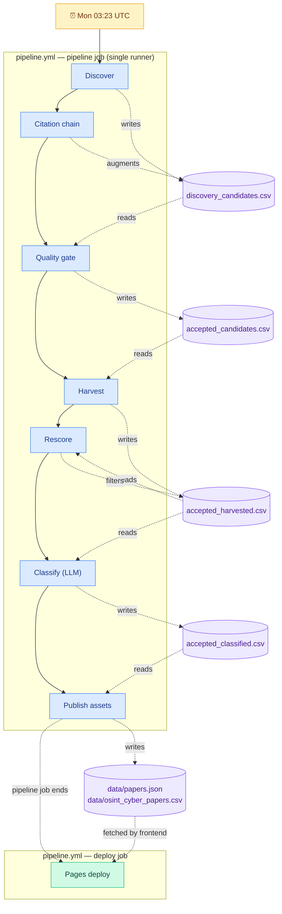

# Alex v2.1.1 Production-Ready Package

Alex is a production-oriented discovery, evaluation, enrichment, and publishing pipeline for building a **high-quality OSINT + cybersecurity research corpus**.

## What this package does

It implements a practical end-to-end system for:

1. **Discovery** across multiple source families
2. **Citation chaining** using OpenAlex and Semantic Scholar
3. **Quality scoring** before public inclusion
4. **Authoritative metadata harvesting**
5. **Post-harvest rescore** with preprint-aware thresholds (re-runs scoring after enrichment fills in abstracts)
6. **LLM taxonomy tagging**
7. **Governance outputs** for review and rejection
8. **Static-site publication** via GitHub Pages

## Source families checked

### Academic indexes
- OpenAlex
- Crossref
- Semantic Scholar
- CORE
- BASE (manual-assist placeholder / ingestion adapter)
- Dimensions (manual-assist placeholder)

### Research repositories
- arXiv
- Zenodo
- GitHub

### Security conferences and archives
- IEEE
- ACM
- USENIX
- DFRWS
- FIRST
- SANS
- Black Hat

### Think-tank / investigative sources
- RAND
- CSIS
- Atlantic Council
- NATO Strategic Communications Centre of Excellence
- Bellingcat

## Query families used

Configured in `config/query_registry.json` and intended for recurring execution:

- open source intelligence
- OSINT methodology
- OSINT investigation
- social media intelligence
- digital investigation techniques
- threat intelligence collection
- internet investigation methods
- dark web intelligence
- OSINT research
- open source investigation
- cybersecurity
- cybercrime research
- cybercrime
- online threats
- APT
- advanced persistent threats

## Quality model

Alex scores candidates on four normalised signals — venue trust, citation density, institution provenance, and topic relevance — combines them with the weights in `config/quality_weights.json`, and adds a +10 institution bonus when affiliations clear a trust threshold. Full formulas (and the routing tables below) are in [`docs/retrieval_gating_taxonomy.md`](docs/retrieval_gating_taxonomy.md).

### Routing policy
| Tier | Peer-reviewed | Preprint (arXiv etc.) |
|---|---|---|
| **Auto-include** | total ≥ **60.0** | total ≥ **35.0** |
| **Review queue** | 45.0 – 59.99 | 20.0 – 34.99 |
| **Reject** | < 45.0 | < 20.0 |

Preprints route on a separate ladder because they structurally lack venue/citation/institution signal. Detection rule: `discovery_source ∈ {arXiv, arXiv RSS}`.

Alex **prefers omission over contamination**. If quality cannot be verified, the record should not enter the public corpus.

## Citation chaining

Alex expands the corpus via:

- **forward chaining (OpenAlex):** title-search OpenAlex → for each hit, fetch its `cited_by_api_url` and add the citing works as new candidates.
- **backward chaining (Semantic Scholar, gated):** title-search S2 → for each hit, fetch up to N references and add them as new candidates. Skipped when `SEMANTIC_SCHOLAR_API_KEY` is unset to avoid a flood of 429s.

Defaults: top-100 seeds by citation count, 8-way concurrency across seeds, 3 search hits × 5 cited-by/refs each per seed. All limits are tunable via `connectors.openalex.citation_chain_*` and `connectors.semantic_scholar.citation_chain_*` in `config/query_registry.json`. Author chaining is in the v2.1 spec but not implemented today.

Primary graph sources: OpenAlex (forward) + Semantic Scholar (backward).

## Classification taxonomy

The LLM classifier (`gpt-4o-mini` by default) tags each accepted paper with `Category`, `Investigation_Type`, `OSINT_Source_Types`, `Keywords`, `Tags`, and `Quality_Tier`. The full taxonomy and prompt live in [`docs/retrieval_gating_taxonomy.md`](docs/retrieval_gating_taxonomy.md). `Seminal_Flag` is set independently — `TRUE` iff `citation_count ≥ 500`.

## Outputs

### Public outputs
- `data/osint_cyber_papers.csv`
- `data/papers.json`

### Internal governance outputs
- `data/discovery_candidates.csv`
- `data/review_queue.csv`
- `data/rejected_candidates.csv`
- `data/quality_metrics.csv`

## How to run

### 1. Install
```bash
python -m pip install -r requirements.txt
```

### 2. Set environment variables
```bash
export HARVEST_MAILTO="you@example.org"
export OPENAI_API_KEY="sk-..."
export OPENAI_MODEL="gpt-4o-mini"
```

### 3. Discover
```bash
python -m alex.cli discover
```

### 4. Citation-chain discovered candidates
```bash
python -m alex.cli chain
```

### 5. Score and route candidates
```bash
python -m alex.cli score
```

### 6. Harvest accepted candidates
```bash
python -m alex.cli harvest
```

### 7. Rescore with full abstracts (post-harvest)
```bash
python -m alex.cli rescore
```
Re-runs relevance scoring after harvest enriches abstracts. Preprints (arXiv, bioRxiv, medRxiv, SSRN) use a separate threshold ladder so they aren't penalised for missing venue/citation/institution signal.

### 8. LLM classify accepted candidates
```bash
python -m alex.cli classify
```

### 9. Rebuild public assets
```bash
python -m alex.cli publish
```

## GitHub Actions included

### Automated
- **`pipeline.yml`** — scheduled **Mon 03:23 UTC**. A single workflow that runs all seven pipeline stages sequentially in one job, then deploys to GitHub Pages as a second job. Uses one runner for all data stages (faster than split workflows and sidesteps GitHub's 3-level `workflow_run` cascade cap). The deploy job pins `actions/checkout` to `ref: main` so it stages the commits the pipeline job just pushed (without this, deploy would silently re-publish the trigger-time SHA).
- `pages.yml` — GitHub Pages deploy on push to `main`. Covers non-pipeline pushes (e.g. human merges). Uses `cancel-in-progress: true` so a newer push supersedes any in-flight deploy rather than queueing behind it.
- `discover_manual_assist.yml` — scheduled Mon 04:05 UTC reminder for human-curated sources (Google Scholar / Dimensions / BASE).

### Manual (`workflow_dispatch` only)
Kept as ad-hoc debug tools that run a single stage:

- `discover.yml`, `citation_chain.yml`, `quality_gate.yml`, `harvest.yml`, `classify.yml`, `publish.yml`
- `tag_new_papers.yml` — re-tag already-harvested papers via LLM
- `rebuild_site.yml` — regenerate site assets from existing classified corpus
- `openai_smoketest.yml` — pre-flight canary that hits `/v1/responses` once and prints the response body + usage. Run it before kicking off the full pipeline whenever the OpenAI account state is uncertain (e.g. after a top-up).

None of these auto-trigger anything else. Use them when you want to re-run a single stage without walking the whole chain.

### Data flow



**Weekly cycle in practice:**

One cron tick kicks off the whole pipeline. `pipeline.yml` runs every stage sequentially in a single job — each stage commits its output to `main` with a clear message so git log still reads as a per-stage audit trail — then a second job deploys the refreshed site to GitHub Pages.

A full end-to-end run takes roughly 15–30 minutes, driven mostly by API-call volume in `Citation chain` (Semantic Scholar) and `Classify` (OpenAI). The site is refreshed at most once per week on Monday; manual re-runs via `workflow_dispatch` on any individual stage workflow are available for ad-hoc updates.

The parallel `Manual-assist discovery queue` reminder fires Monday 04:05 UTC for human curation of Google Scholar / Dimensions / BASE. Candidates added by hand before the following Monday are picked up on the next cycle.

## Important operational notes

- Google Scholar and Dimensions are represented as **manual-assist / registry-backed sources**, because reliable direct automation is constrained by access, terms, or subscription.
- BASE and some conference / think-tank sources are handled through adapter registries and source-specific ingestion targets; connectors are provided as extensible modules.
- The package is designed to be **production-oriented**, but actual performance depends on API keys, quotas, and data-source availability.

## Operations runbook

### Required GitHub repository secrets
- `HARVEST_MAILTO` — contact email sent in the User-Agent header to academic APIs (politeness contract).
- `OPEN_API_KEY` — OpenAI API key. Note the secret name is `OPEN_API_KEY` (not `OPENAI_API_KEY`); the workflows map it onto the `OPENAI_API_KEY` env var.

### OpenAI quota canary
LLM classification spends OpenAI credits, and `gpt-4o-mini` is cheap but not free. When the account runs out of credits OpenAI returns `429 insufficient_quota` per request. The pipeline now treats this as a **fatal** error and aborts (`OpenAIQuotaError` in `alex/pipelines/classify.py`) rather than silently stamping every paper as `Category="Other"`.

Before running the full pipeline after any uncertain account state (top-up, billing change, new key), trigger the **`OpenAI smoketest`** workflow:

- ✅ `status: 200` with a `usage` block printed → quota is good, run the Pipeline.
- ❌ `status: 429` with `"code":"insufficient_quota"` → top up the OpenAI account first.

Each successful classify run prints a token-usage summary (`OpenAI usage: N calls, X input + Y output = Z total tokens`) so you can track spend without scraping logs.

### Site deploy (GitHub Pages)
The published corpus lives at `https://riseinfosec.github.io/Alex/`. Deploys can wedge if the `github-pages` environment has a non-terminal deployment status:

```bash
# Find any deployment in waiting/queued/in_progress state
gh api 'repos/RISEInfoSec/Alex/deployments?environment=github-pages&per_page=100' --jq '.[].id' | \
  while read id; do
    state=$(gh api repos/RISEInfoSec/Alex/deployments/$id/statuses --jq '.[0].state')
    [ "$state" = "waiting" ] || [ "$state" = "queued" ] || [ "$state" = "in_progress" ] && \
      echo "STUCK: $id state=$state"
  done

# Clear a stuck one
gh api repos/RISEInfoSec/Alex/deployments/<id>/statuses -X POST -f state=inactive -f description="manual clear"
```

### Cost / runtime envelope (Apr 2026 baseline)
- Citation chain: **~28 min** for ~1k forward-chain candidates from OpenAlex
- Harvest: **~17 min** parallelised (was ~50 min serial)
- Classify: serial OpenAI calls; **~1 sec/paper** when quota is healthy. Full backfill of 1.5k papers ≈ 25 min.
- Quality gate, Rescore, Publish, Pages deploy: each well under 1 min

See `docs/gap_analysis.md` for remaining operational constraints and how to address them.
