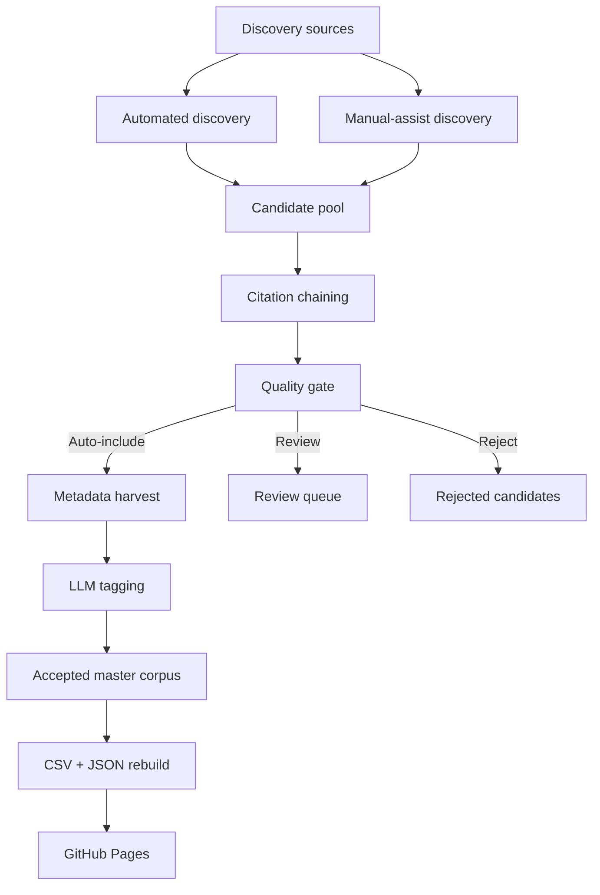
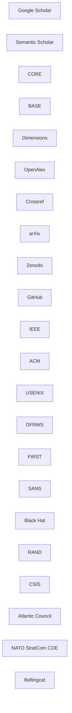

# Alex v2.1 diagrams

## Pipeline

```mermaid
flowchart TD
    A[Discovery sources] --> B[Automated discovery]
    A --> C[Manual-assist discovery]
    B --> D[Candidate pool]
    C --> D
    D --> E[Citation chaining]
    E --> F[Quality gate]
    F -->|Auto-include| G[Metadata harvest]
    F -->|Review| H[Review queue]
    F -->|Reject| I[Rejected candidates]
    G --> J[LLM tagging]
    J --> K[Accepted master corpus]
    K --> L[CSV + JSON rebuild]
    L --> M[GitHub Pages]
```

## Source universe

```mermaid
flowchart LR
    GS[Google Scholar]
    SS[Semantic Scholar]
    CORE[CORE]
    BASE[BASE]
    DIM[Dimensions]
    OA[OpenAlex]
    CR[Crossref]
    ARX[arXiv]
    ZEN[Zenodo]
    GH[GitHub]
    IEEE[IEEE]
    ACM[ACM]
    USX[USENIX]
    DFRWS[DFRWS]
    FIRST[FIRST]
    SANS[SANS]
    BH[Black Hat]
    RAND[RAND]
    CSIS[CSIS]
    AC[Atlantic Council]
    NATO[NATO StratCom COE]
    BC[Bellingcat]
```
